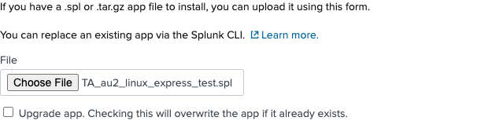
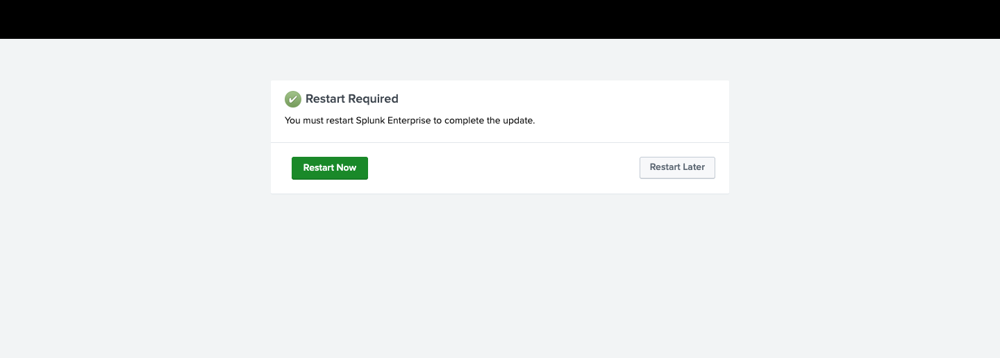
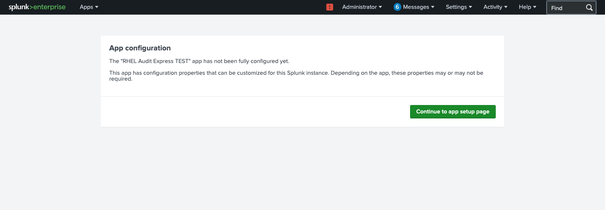
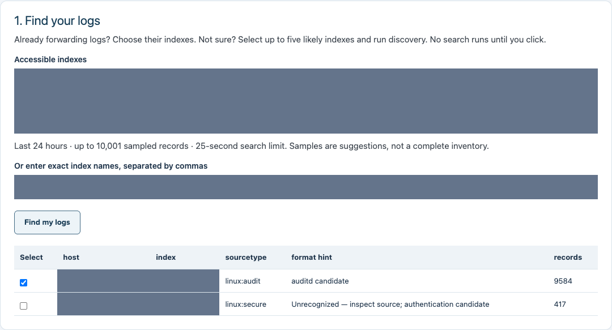
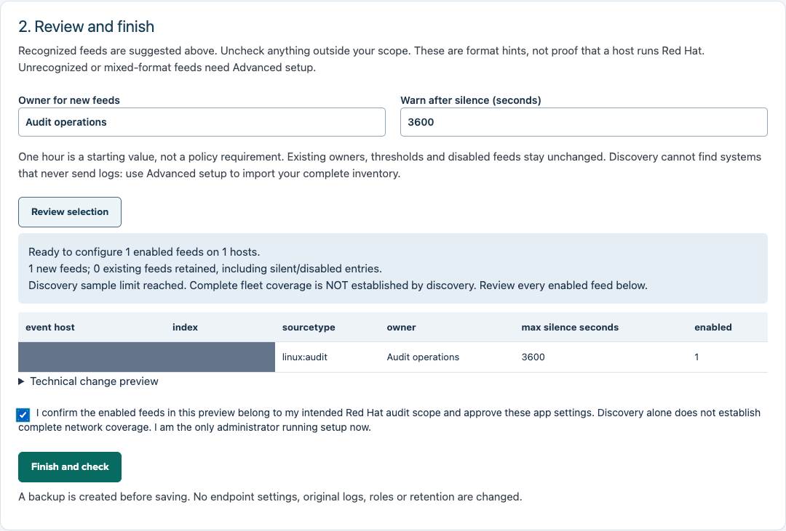
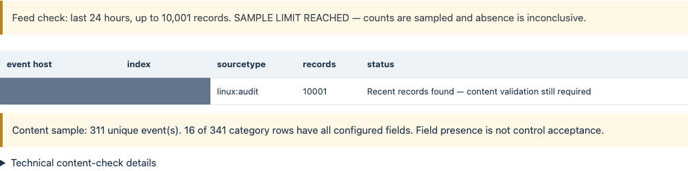
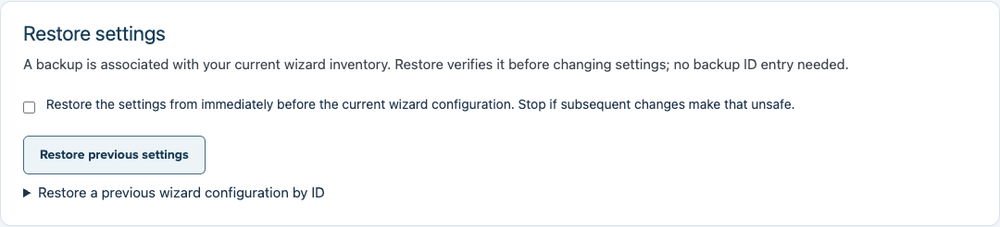

# Install with Express setup

**For:** a Splunk administrator helping an ISO connect already-forwarded Red Hat
logs to the audit dashboard. **Result:** a saved, backed-up app configuration and
visible setup-check results—not an automatic compliance pass.

This guide matches **RHEL Audit Verification 1.5.1-rc1**. The pictures are actual
Splunk Enterprise 10.4.3 browser screenshots from an isolated integration-test
app. Its title and installer contain **TEST**; install the normal release file
listed below, not the test file pictured. Gray blocks hide private host/index
identities. Results are observations from that test, not sample production guarantees.

## Before you begin

- Use a supported standalone Splunk Enterprise installation and an administrator
  who can install apps and change this app's configuration.
- Have Universal Forwarder logs already indexed and know their approved index
  names. This installer does not configure forwarders, receivers or audit rules.
- Know which Red Hat hosts belong to your scope. Discovery cannot find a host
  that has never sent logs. Use Advanced setup to import your complete inventory.
- For an upgrade, back up the existing app, local settings, operational lookups
  and receipts. Keep the previous verified installer.

Cloud, clustered deployments and inventories above 200 feeds require a managed
deployment plan; this walkthrough does not certify them. See [installation
reference](INSTALLATION.md) for prerequisites and the manual alternative.

## 1. Download and upload the app

1. Download `TA_au2_linux-1.5.1.spl` and `SHA256SUMS` from the release assets, or
   unpack the complete handoff ZIP and open its `dist` directory.
2. Verify the checksum in that directory:

   ```sh
   # Linux
   sha256sum -c SHA256SUMS
   # macOS: use this instead
   shasum -a 256 -c SHA256SUMS
   ```

3. Sign into Splunk Web. Open **Apps → Manage Apps → Install app from file**.
4. Choose `TA_au2_linux-1.5.1.spl`. Select **Upgrade app** only when upgrading
   an existing installation after its backup. Click **Upload**.



**If Manage Apps stays on “Loading”:** in the tested instance, the native upload
form still worked at `/en-US/manager/appinstall/_upload` on the same authenticated
Splunk Web origin. Your administrator can check that route without changing any
server settings. Do not disable security controls to work around a failed page.

## 2. Read the installation result

Follow Splunk's installation result and your site's change process. Our fresh
test-app installation displayed **Restart Required**. We did not restart the
shared server; the tested app pages were usable, but this does not clear the
server's notice or prove that every installation is restart-free. An authorized
administrator must decide when any requested restart can occur.



Open **RHEL Audit Verification** from Apps. If Splunk displays **App
configuration**, select **Continue to app setup page**.



## 3. Find your logs

1. Leave **Express setup** selected.
2. Select one to five approved indexes, or type their exact names separated by
   commas. When only one non-internal index is listed, it is suggested—not searched
   without your click.
3. Click **Find my logs**.
4. Review the results. Recognized-format feeds are suggested with checked boxes.
   Uncheck anything you do not intend to audit. A format hint does not prove the
   host runs Red Hat or that its source has every required field.



Discovery checks the last 24 hours, at most 10,001 records, with a bounded search
time. A sample-limit warning means this is not a complete inventory. No results
means investigate index, time, permissions and collection—not “compliant.”

Unrecognized or mixed-format feeds require **Advanced setup** and source inspection.
Do not rename a sourcetype merely to make Express recognize it.

## 4. Review and finish

1. Set the owner and silence threshold for **new** feeds. The initial values are
   **Linux operations** and **3600 seconds (one hour)**; choose values appropriate
   for your operation. These are not policy requirements.
2. Click **Review selection**.
3. Review every enabled feed. Existing entries, including silent and disabled
   feeds, remain unchanged. Advanced setup is required to change those entries.
4. Check the confirmation only when the preview is your intended Red Hat scope.
5. Click **Finish and check** and keep the page open.



The app creates a backup, saves a new inventory, updates its search scope and
setup-complete flag, and reads the settings back. It then runs setup checks.
It does not change source audit rules, inputs, indexed logs, roles or retention.

Changing the selection or mode invalidates the preview and confirmation. A
concurrent administrator change stops the save rather than silently replacing it.

## 5. Read the results before opening the dashboard

Check the feed table and content summary. The pictured result contains records
but still has missing content: receiving events is not enough to accept a control.



| Result | Your next action |
|---|---|
| Recent records found | Continue to event review; verify content and semantics. |
| No records or older than threshold | Check the host, index, time range, access and collection. |
| Sample limit reached | Narrow the scope or use fuller readiness searches; absence is inconclusive. |
| No normalized events | The recent content sample cannot be assessed. Do not count it as a pass. |
| Settings saved; checks incomplete | Settings remain saved. Resolve the check error, then **Check saved setup** or restore. |
| Save outcome uncertain / recovery needed | Stop. Have the administrator inspect the backup and current state before retrying. |

Select **Open event dashboard** to begin the [illustrated event review
workflow](USING-THE-APP.md). Repeat relevant checks using the intended analyst
account; an administrator's successful check does not establish analyst access.

## Restore the previous settings

In **Restore settings**, confirm the action and select **Restore previous
settings**. The app finds the backup tied to its current wizard inventory—even
after a page reload. It refuses a restore when subsequent changes make that
unsafe. Original logs and old inventory files are not deleted.



If no current backup is identified, expand **Restore a previous wizard
configuration by ID** and use a known backup ID. A partial restore is an
administrator investigation, not a successful rollback. Full safeguards and
limits are in the [setup reference](SETUP-WIZARD.md).

## Next steps

- [Review events and investigate missing content](USING-THE-APP.md).
- [Import a complete expected-feed inventory with Advanced setup](SETUP-WIZARD.md).
- [Export and record a weekly review](WEEKLY-REVIEW.md).
- [Read exactly what has and has not been validated](VALIDATION.md).
