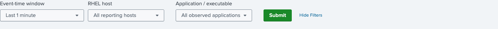
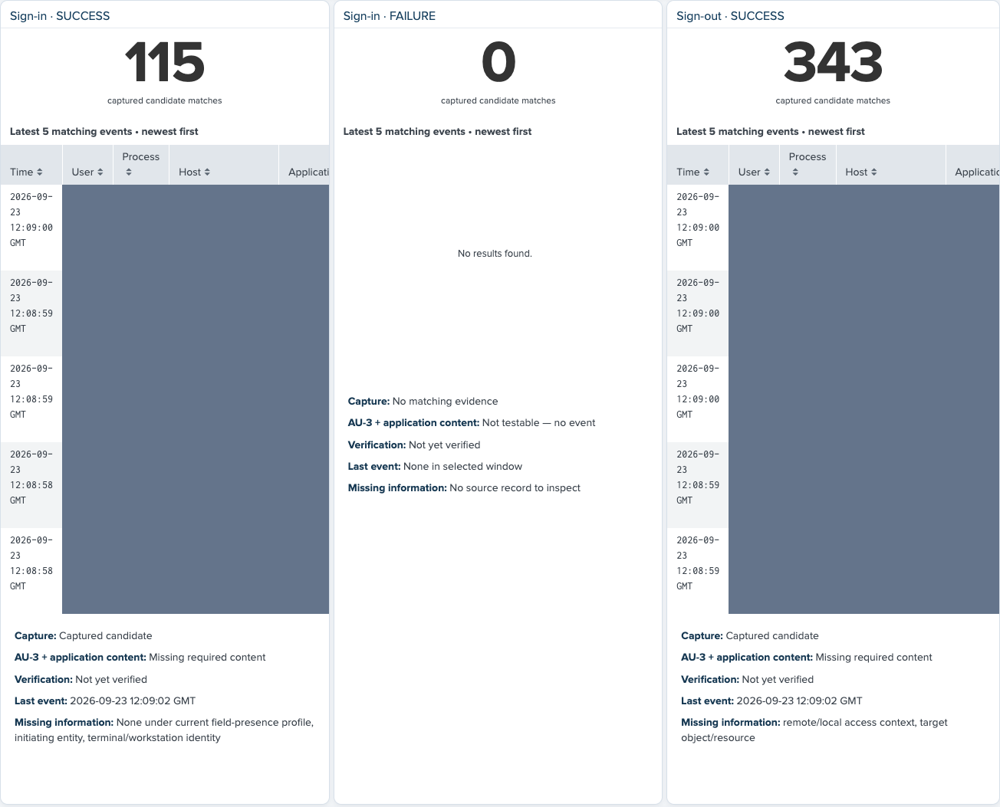
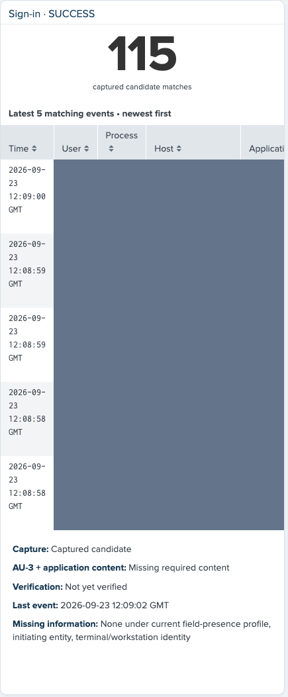
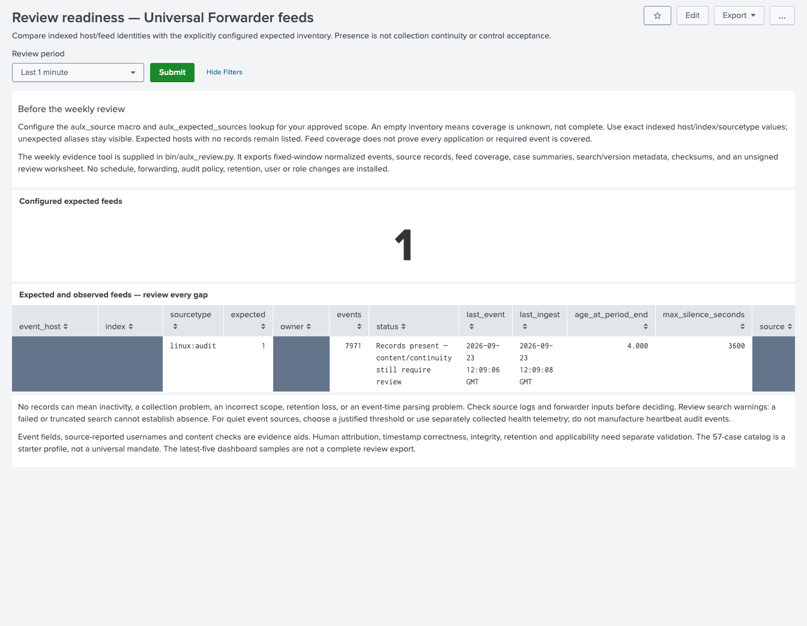

# Review events and investigate gaps

**For:** an ISO or analyst reviewing RHEL evidence after [Express
installation](EXPRESS-INSTALL.md). **Result:** an evidence-backed review of
capture, event content and unresolved gaps. A dashboard count alone is not a
control determination.

The screenshots show **1.5.1-rc1** in an isolated app on Splunk Enterprise 10.4.3.
They use real indexed records, not generated example events. Gray blocks mask
private identities and source details. Counts and dates belong to the pictured
test window; they are not expected values for your environment.

## 1. Choose a small review window

1. Open **RHEL Audit Verification — AU-2 / AU-3** from the app navigation or
   select **Open event dashboard** after setup.
2. Choose an **Event-time window**. Start with a short interval around an event
   you know occurred. The pictured walkthrough uses one minute to limit load.
3. Select the **RHEL host** and, if appropriate, **Application / executable**.
4. Select **Submit**. Wait for searches to finish and inspect any search warnings.

Do not draw conclusions from running searches, error panels, unresolved values
or truncated results. Host/application selectors are based on observed data;
missing hosts must be checked against expected inventory separately.

## 2. Review success and failure separately

Find **Authentication and session events**. It has separate squares for
**Sign-in · SUCCESS**, **Sign-in · FAILURE** and **Sign-out · SUCCESS**. Other
categories use the same count, recent-samples and content-status layout.

For each required action/outcome, read:

| Item | What to do with it |
|---|---|
| Captured candidate matches | Establish that matching records are searchable in this scope. Check semantics; a match is not an accepted event test. |
| Latest 5 matching events | Inspect recent examples. They are not the full evidence set or a statistically representative sample. |
| Capture | Distinguish a candidate from no matching evidence. |
| AU-3 + application content | Investigate missing content; field presence still needs review. |
| Verification | Require genuine reviewed evidence; never manufacture a receipt to change this status. |
| Last event / Missing information | Check timing and the named content gaps against original records. |

A zero is **no matching evidence in this window**, not proof of no activity or
proof that collection is disabled. The same event can match multiple categories.
OS Restart aliases Reboot; do not add those counts as independent activity.

## 3. Inspect who, what and where

Read the recent sample rows. **User** is the source-reported actor; **Process**
is process identity. **Host** and **Application** identify the observed system
and program. Session-origin/source columns are separately derived context, not
a replacement for missing direct event fields.

For fuller content, scroll to **Event evidence — recent samples with full
extracted content and gaps**. Compare event keys, timestamps, identities,
objects, outcomes and evidence references with the original indexed record and,
when validating an event, the source record. The detail table is still a bounded
recent-sample view, not a complete export.

Do not replace unknown users with guesses. A failed-login username can be the
attempted account rather than a proven person. A logged-in SSH session near a
USB observation does not prove who inserted the device. Review USB observations
separately from media import/export and from physical-user attribution.

## 4. Check for missing feeds

1. Open **Review readiness — Universal Forwarder feeds**.
2. Choose the intended **Review period** and select **Submit**.
3. Verify **Configured expected feeds** is the inventory you intended.
4. Review every row in **Expected and observed feeds — review every gap**.

If inventory is empty, coverage is unknown. If a feed is absent or stale, check
source generation, forwarder inputs and file permissions, transport, index,
host alias, timestamp parsing and retention. Preserve the gap while investigating.
A fresh event does not prove lossless delivery across log rotation or an outage.

## 5. Record the review and preserve evidence

Record the period, scope, reviewed event categories, anomalies, missing fields,
source comparisons and follow-up actions. For a fixed-window evidence package,
follow [Export and complete a weekly review](WEEKLY-REVIEW.md). That workflow
preserves original indexed records, normalized results, metadata and checksums;
the human review remains explicit.

Do not put real logs, user identities, inventories, receipt files or evidence
exports in the public code repository. Use your approved protected evidence store.

## When to stop and investigate

- A search fails, is truncated, or is still running.
- A required category has no evidence after a known controlled action.
- Identity, target, outcome or application context contradicts the source.
- Source loss, time skew or partial multi-record audit events undermine the sample.
- A UI result looks complete but no matching source/test evidence supports it.

The app helps expose those conditions; it does not waive them.

## Next steps

- [Understand current validation boundaries](VALIDATION.md).
- [Maintain expected feeds and restore setup settings](SETUP-WIZARD.md).
- [Prepare a fixed-window weekly review](WEEKLY-REVIEW.md).
- [Return to the quick start](QUICKSTART.md).
